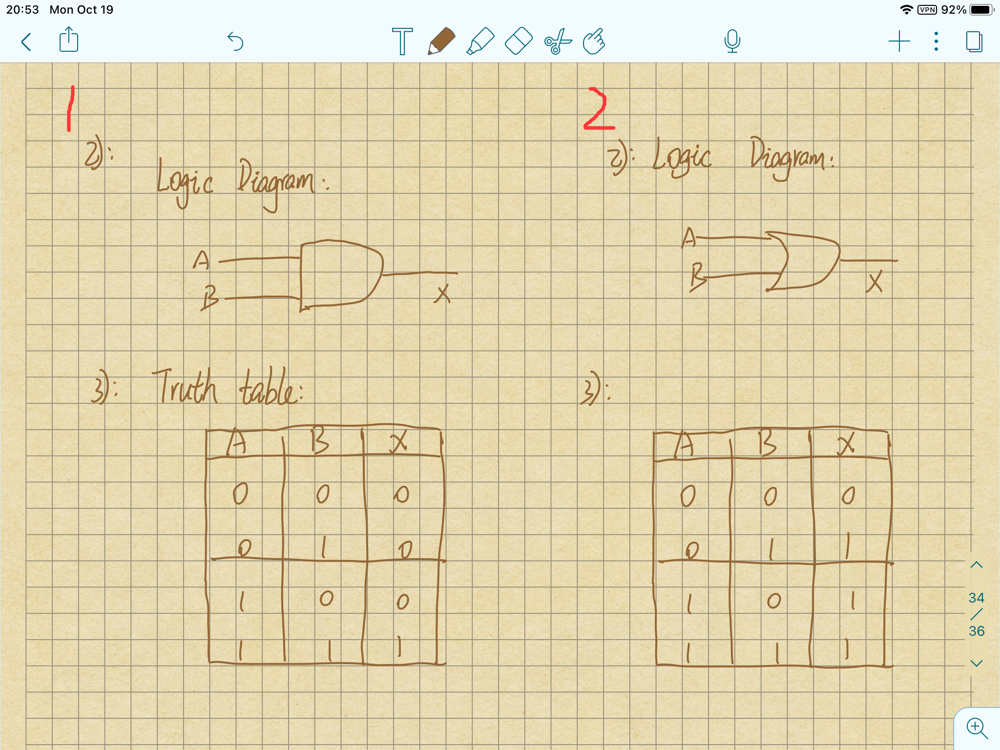
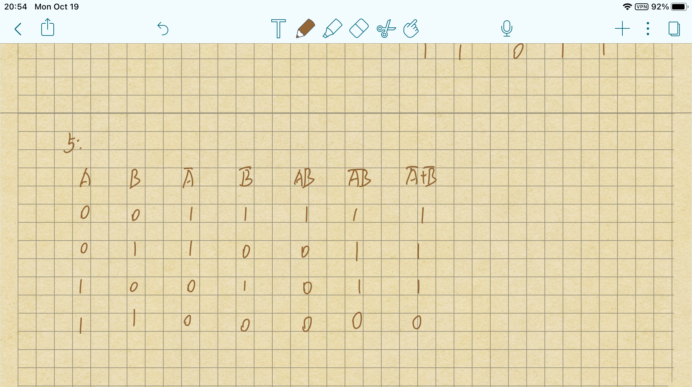

# part1
1. Give the three representations of an AND gate and say in your words what AND means.
2. Give the three representations of an XOR gate and say in your words what XOR means.
3. Draw a circuit diagram corresponding to the following Boolean expression: (A + B)(B + C)
4. Show the behavior of the following circuit with a truth table:
5. What is circuit equivalence? Use truth table to prove the following formula. (AB)’ = A’ + B

解:

1. Boolean expression: X = AB
2. Boolean expression: X = A＋B 
)
3. 
4.  如图
    
5. 如图
    

# part2
6. There are eight 1bit full adder integrated circuits. Combine them to 8bit adder circuit using the following box diagram.
7. Logical binary operations can be used to modify bit pattern. Such as(X8X7X6X5X4X3X2X1)2 and (00001111)2 = (0000X4X3X2X1)2 We called that (00001111)2 is a mask which only makes low 4 bits to work. Fill the follow expression 
    1. (X8X7X6X5X4X3X2X1)2 or (00001111)2 = ( )2
    1. (X8X7X6X5X4X3X2X1)2 xor (00001111)2 = ( )2
    1. ((X8X7X6X5X4X3X2X1)2 and (11110000)2 ) or (not (X8X7X6X5X4X3X2X1)2 and (00001111)2
    ) = ( )2

解
6.  
7. 
    1. (X8X7X6X5X 1111)
    1. (X8⊕0 X7⊕0 X6⊕0 X5⊕0 X4⊕1 X3⊕1 X2⊕1 X1⊕1)
    1. (X8X7X6X5X4X3X2X1)
# Part3
## Logic gate
A logic gate is an idealized or physical electronic device implementing a Boolean function, a logical operation performed on one or more binary inputs that produces a single binary output.

## Boolean algebra
In mathematics and mathematical logic, Boolean algebra is the branch of algebra in which the values of the variables are the truth values true and false, usually denoted 1 and 0, respectively.

自学存储电路。维基百科：“Flip-flop”，选择中文：
1. Flip-flop 中文翻译是？
2. How many bits information does a SR latch store?

解:
1. Flip-flop : 触发器
2. 1
