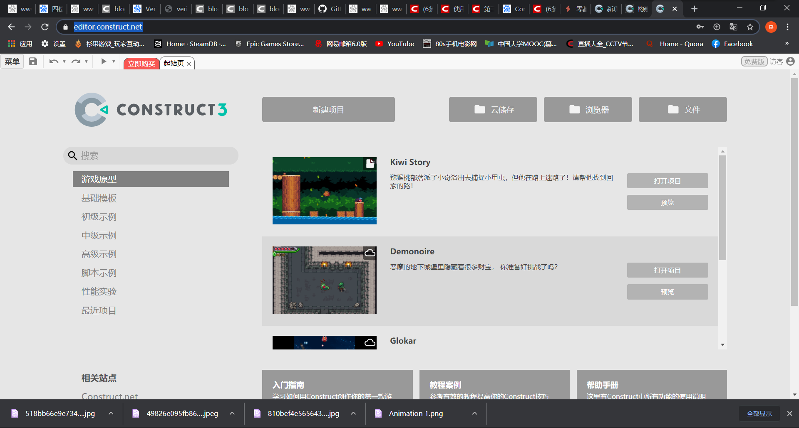
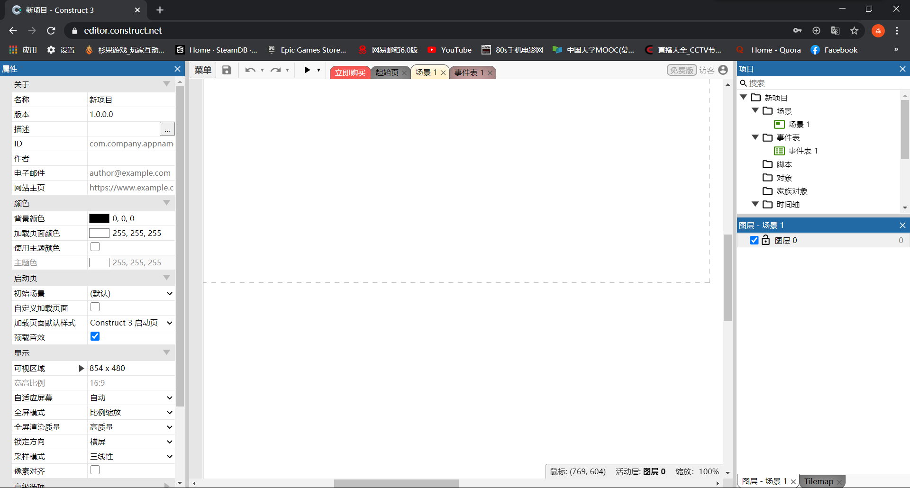
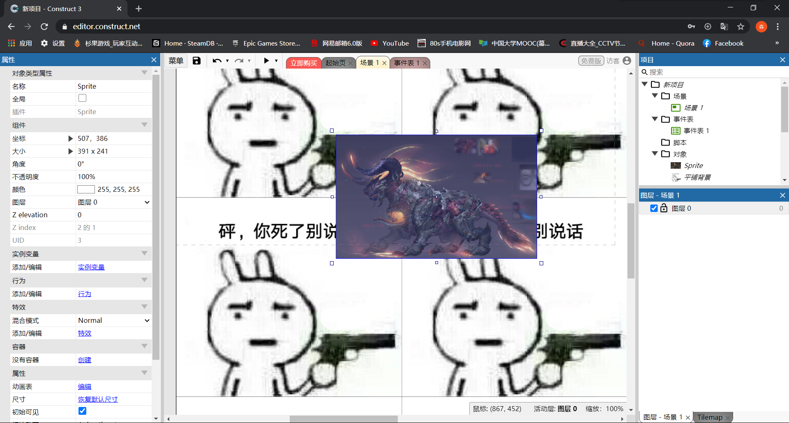
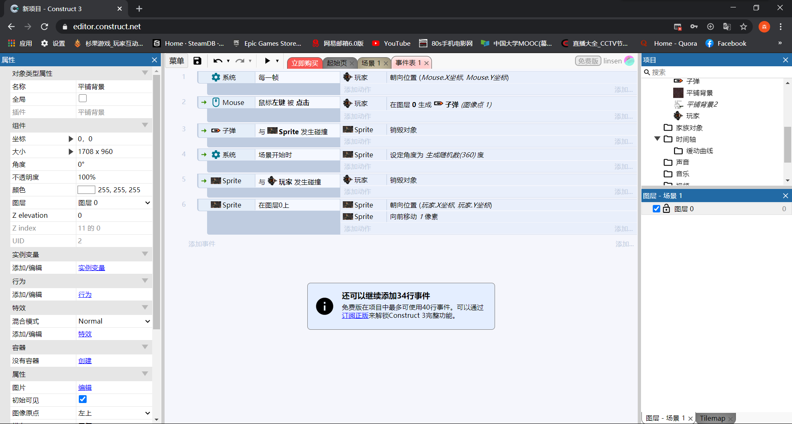

## 以Construct 3制作平台游戏的新手指南

1. 首先你需要打开这个[网站](https://editor.construct.net/)，然后注册登录。之后便可以进行游戏的制作啦

1. 游戏制作第一步,先创建新项目.

1. 游戏制作的第二步,你需要给你的游戏选一张背景图. 

1. 选择好背景之后就可以选择游戏的人物了 

1. 人物已经创建好了,接下来就是加一些事件了 

1. 好了,游戏已经创建好了,现在保存预览就可以了,记得保存到本地或者云中.

这是我的[游戏链接](https://1drv.ms/u/s!ArFPSUa8wU09j1JPL4Uyop-Gkbej?e=IjRNGt)